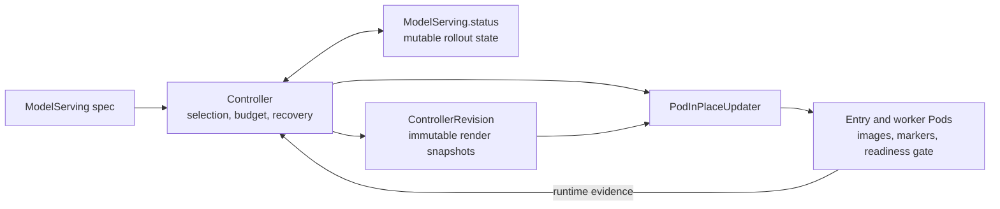
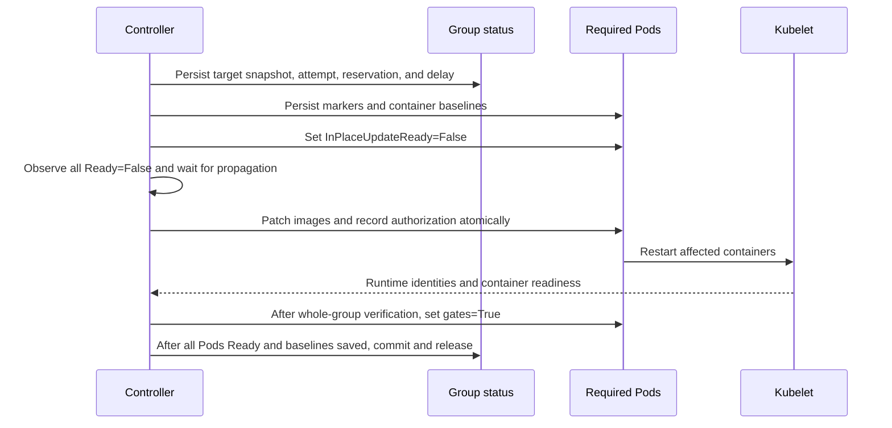
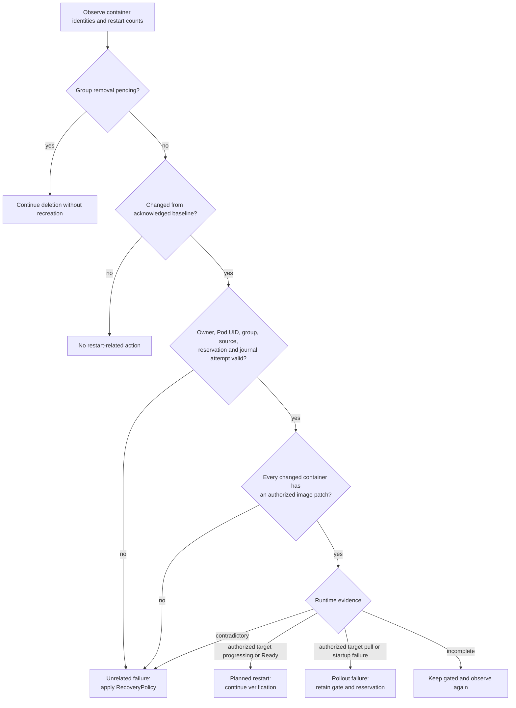

## ModelServing In-Place Rolling Update

### Summary

This proposal adds an opt-in `InPlaceRollingUpdate` strategy for `ModelServing`. For eligible image-only changes, Kthena patches regular-container images on existing entry and worker Pods. A successful rollout preserves Pod names, UIDs, IPs, node placement, Pod-scoped volumes, Services, and PodGroups; only affected processes restart.

ServingGroup is the rollout unit. The controller reserves availability, withdraws the selected group from readiness-based traffic, patches its Pods, and restores readiness after verifying the whole group. Durable state makes this resumable after controller restart and distinguishes planned container restarts from failures. Existing replacement strategies remain the default.

### Motivation

`ServingGroupRollingUpdate` and `RoleRollingUpdate` currently replace outdated resources. Replacement is necessary for immutable Pod changes, but it is unnecessarily expensive when only a container image changes. Recreating a ServingGroup or Role can lose:

- Pod identity, IP, and node placement;
- accelerator and topology assignments;
- Pod-scoped data such as downloaded models or caches in `emptyDir`;
- existing Services and PodGroups; and
- scheduling and gang-admission work already completed for the workload.

Large inference workloads are particularly sensitive to rescheduling, image distribution, model initialization, and cache warm-up. An in-place update still restarts the affected process and does not preserve process memory, but it avoids repeating unrelated scheduling and data-preparation work.

Directly patching images is not enough. The current controller may interpret the expected container restart as a failure and apply the configured recovery policy. Rollout status also assumes a homogeneous revision within a ServingGroup. The new strategy therefore needs coordinated validation, availability accounting, durable state, restart classification, and completion reporting.

#### Goals

- Preserve Pod identity and placement during eligible image updates across a ServingGroup, controlled by `partition` and `maxUnavailable`.
- Reject an unsafe change in any Role before updating the group.
- Gate the whole group until runtime verification completes, and resume safely after controller restart.
- Allow an unfinished or failed update to receive a new eligible target within its existing availability reservation.
- Support preparation of existing Pods, explicit strategy cancellation, scaling, and normal recovery.
- Expose preparation, progress, completion, and blocked or stalled work through status and events.

#### Non-Goals

- Role-scoped in-place updates, surge capacity, init-container updates, non-image Pod changes, or refreshing an unchanged mutable image tag.
- Automatic rollback or replacement after an image failure, a generic `InPlaceIfPossible` strategy, or installation of OpenKruise components.
- Guaranteed request draining or preservation of process-local memory and caches. Applications must tolerate independent container restarts.

### Proposal

Users select `spec.rolloutStrategy.type: InPlaceRollingUpdate` and reuse the ServingGroup-level `RollingUpdateConfiguration`:

```yaml
apiVersion: workload.serving.volcano.sh/v1alpha1
kind: ModelServing
metadata:
  name: llama
spec:
  replicas: 4
  rolloutStrategy:
    type: InPlaceRollingUpdate
    rollingUpdateConfiguration:
      maxUnavailable: 1
      partition: 0
      readinessPropagationDelaySeconds: 5
  template:
    roles:
      - name: server
        replicas: 1
        workerReplicas: 0
        entryTemplate:
          spec:
            containers:
              - name: inference
                image: example.com/inference:v2
                imagePullPolicy: IfNotPresent
```

#### Key Scenarios

| Scenario | Expected behavior |
| -------- | ----------------- |
| Eligible images change in one or more Roles | Update each selected ServingGroup as one unit within partition and availability limits; preserve its Pod identities and placement. |
| An image update also changes a Role's `workerReplicas` or another unsafe field | Reject the entire request, including otherwise eligible Roles. |
| A patched image fails to pull or start | Keep the group gated and its availability slot reserved. A later eligible image may retarget it; switching to a replacement strategy authorizes recreation. |
| In-place mode is enabled for existing gate-less Pods | Perform a one-time replacement using the applied images to add readiness gates. Image updates wait for preparation to finish. |
| The controller restarts during an update | Resume from durable state and live Pod evidence, retaining the reservation and distinguishing planned restarts from unrelated failures. |
| The user switches to a replacement strategy during an update | Cancel the active update and force replacement even when revision labels already match or partition would otherwise protect the group. |

#### Risks and Mitigations

| Risk | Mitigation and remaining limitation |
| ---- | ----------------------------------- |
| Preparing existing Pods disrupts identity and placement | Announce preparation through status, require a positive `maxUnavailable` budget, and complete it before image updates. Preparation ignores partition and necessarily recreates gate-less Pods. See Preparation and Strategy Changes. |
| Runtime image reporting cannot prove that the target is running | Check source evidence before reservation and keep unverifiable targets gated after patching. Publish tested runtime versions; an update may remain blocked until a different eligible target or explicit replacement succeeds. See Runtime Evidence and Completion. |
| Traffic still reaches a restarting process | Gate the whole group and wait for readiness propagation before patching. The delay does not acknowledge draining; in-flight requests, direct Pod-IP traffic, and headless discovery remain outside the guarantee. See Rollout Protocol, Readiness, and Availability. |
| An expected restart triggers recovery, or an unrelated failure is overlooked | Match each container's restart against durable patch authorization and retained baselines, including after controller restart. Incomplete evidence keeps the group gated; unrelated failures follow `RecoveryPolicy`. See Restart Classification. |

### Design Details

#### API and Eligibility

The API adds the opt-in `InPlaceRollingUpdate` strategy. `ServingGroupRollingUpdate` remains the default; replacement strategies support arbitrary template changes.

```go
const (
    ServingGroupRollingUpdate RolloutStrategyType = "ServingGroupRollingUpdate"
    RoleRollingUpdate         RolloutStrategyType = "RoleRollingUpdate"
    InPlaceRollingUpdate      RolloutStrategyType = "InPlaceRollingUpdate"
)
```

| Control | In-place behavior |
| ------- | ----------------- |
| `maxUnavailable` | ServingGroup budget, default 1. Percentages use desired replicas and round down. Must resolve above zero when `replicas > resolvedPartition`. |
| `partition` | Protects the first N existing groups in ascending ordinal order; percentages round up. Existing reservations finish their recorded target. |
| `maxSurge` | Only omitted, integer `0`, or `"0%"` is allowed, even at zero replicas. Role-level controls remain exclusive to `RoleRollingUpdate`. |
| `readinessPropagationDelaySeconds` | In-place only; nonnegative, default 5. Each reservation captures its value. The wait starts after all required Pods are observed `Ready=False`; zero disables the additional wait. |

Admission and reconciliation validate creation and every relevant strategy, scaling, or control change. Reject malformed or negative values. Zero unavailable is allowed only for zero replicas or a fully protected population; preparation with nonzero replicas requires a positive budget even under full partition. Reducing the budget preserves committed work and limits new reservations. Positive surge cannot compensate for zero unavailable.

Admission compares defaulted render inputs: replacing the new regular-container images with their old values must leave them semantically equal, except for permitted replica scaling and rollout controls. Role/container names and order, entry/worker structure, init containers, non-image Pod fields, plugins, scheduler, and `workerReplicas` must remain unchanged. Worker count changes alter topology and require replacement. If any Role is ineligible, reject the entire request.

Every Pod must have effective `restartPolicy: Always`, with no regular-container restart overrides or rules. Omission uses Kubernetes' default `Always`; users need not specify it. Effective pull policies must also remain equal. A shared resolver handles comparison and rendering, and new Pods receive explicit policies. For example, an omitted pull policy changing from `:latest` to a pinned tag requires explicitly preserving `Always`. Creates validate compatibility without historical comparison.

Before reservation and patching, the controller rechecks the applied snapshot and live Pods for eligibility, ownership, policies, gates, and image evidence. Unsafe drift or missing/inconsistent history blocks mutation without replacement fallback. Enabling the strategy starts preparation where needed; subsequent image changes require its acknowledgment.

#### Controller Responsibilities and Durable State

The ModelServing controller owns selection, reservations, recovery, and replacement. `PodInPlaceUpdater` patches eligible images and owned metadata/status; it never deletes Pods or selects fallback behavior.



Mutable control state belongs in `ModelServing.status`, immutable render snapshots in `ControllerRevision`, and container evidence in Pod annotations/status. The existing datastore remains a rebuildable cache; process-local state cannot authorize patches, gate restoration, or recovery suppression after restart or failover. A reservation records committed work before readiness changes, preventing concurrent selection or controller restart from overspending availability.

The additive `servingGroupRevisions` list is keyed by ordinal and records:

| State | Purpose |
| ----- | ------- |
| `groupID` and completed revision/snapshot pair | Identify the allocation and its applied inputs. Persist before child creation; recovery and preparation preserve the allocation. |
| Target pair, reservation ID, `updateAttempt`, and `authorizedAttempts` | Identify committed work and retain earlier patch authorizations during retargeting. Attempts are immutable and numbered uniquely within a reservation. |
| Captured propagation delay and start time | Resume withdrawal safely after controller restart. |
| `replacementRequired` and `removalPending` | Persist preparation/cancellation and intentional deletion; removal takes precedence. |

Partial or inconsistent reservation state blocks mutation. Resource-version guards protect status transitions. Callbacks enqueue work; reservation changes, Pod patches, and recovery decisions are serialized per ModelServing and revalidated against live state.

##### Revision Integration

Extend the existing revision core and wire it into creation, replacement, scaling, recovery, and status before enabling in-place updates. Preserve public legacy revision and Role hashes. A separate `render-v1` snapshot captures effective Roles, scheduler, plugins, pull/restart policies, and readiness gates; replica counts and rollout controls are excluded, but `workerReplicas` remains included. Canonical `v1` preserves template default intent; the render snapshot records the materialized values needed for safe comparison and recreation.

Snapshots name exact immutable `ControllerRevision` objects. Reuse ownership checks, collision handling, and restoration that preserves live operational fields. Legacy, canonical `v1`, and `render-v1` formats must remain distinct; older or unknown data cannot supply missing applied-state evidence.

All strategies share history collection. Retain references from status, attempts, pending replacement/removal, and live Pod markers, including completed markers. Only unreferenced history counts toward `revisionHistoryLimit`; prune after durable updates and live-reference checks.

Replacement selection compares effective snapshots as well as public hashes, so plugin, scheduler, and gate changes affect every relevant Role. A replacement latch also forces selection despite matching hashes or snapshots. Completed group state advances only after convergence; retain mixed Role-instance history until then.

#### Rollout Protocol, Readiness, and Availability

Handle intentional removal, cancellation, existing reservations, and pending recovery before new selection. Role scaling precedes new reservations; active reservations may continue during scaling. Partition governs new image selections.



Every required Pod has the `workload.serving.volcano.sh/InPlaceUpdateReady` gate. Persist markers/baselines, then set gates to `False`. Patch no image until every Pod has matching markers/gates, is observed `Ready=False`, and the propagation delay has elapsed. Persist the start time after that observation; reset it on membership or gate changes.

The delay lets Pod readiness, EndpointSlices, Services, and router caches propagate withdrawal. It is not a drain acknowledgment. Readiness-filtered traffic withdraws; headless Services retain `publishNotReadyAddresses: true` for discovery. Direct Pod-IP traffic and in-flight requests remain outside the guarantee.

Preconditioned image patches check ownership, resource version, layout, and policies, and atomically record authorization with images and revision/snapshot/Role metadata. Conflicts require fresh reads and revalidation; unexplained drift blocks mutation. Metadata-only Pods stay gated with the group.

Before restoring any gate, verify every required Pod's latest target metadata/spec, policies, runtime evidence, and `ContainersReady=True`. Missing or malformed markers never authorize gate restoration. Then wait for all Pods to become `Ready=True`, persist acknowledged baselines, advance completed state, and release the reservation.

```text
unavailable = not fully Ready groups
            union active reservations
            union replacementRequired groups
            union pending recovery groups
            union removalPending groups with remaining children

remainingBudget = max(0, maxUnavailable - cardinality(unavailable))
```

Count each live or durably allocated group once, including protected and terminating groups. Healthy groups require remaining budget. Already unavailable groups may be selected after pending recovery is resolved and removal is excluded. Intentional scale-down can proceed at zero budget without authorizing additional image updates.

#### Restart Classification

Classify restarts before ordinary Ready/error handling and during startup reconstruction. Neither `restartCount > 0` nor the target image in Pod spec proves an authorized restart.

Before patching, a versioned Pod marker records owner/Pod UIDs, group allocation, Role, reservation, source/target pairs, attempt, phase, and regular/init-container identities and restart counts. Each image patch atomically journals its selected containers, target references, and pre-patch baselines. Unresolved journals survive retargeting; markers must agree with durable group authority.

Compare against the pre-patch baseline while unresolved, then the acknowledged baseline after verification. Retain completed baselines after releasing the reservation so controller restart does not confuse an acknowledged rollout restart with a later failure.



- **Planned restart:** a selected regular container restarts after authorization for its exact target. Continue verification; only the latest attempt can complete.
- **Rollout failure:** a still-authorized target fails to pull or start. Retain gates and reservation; allow eligible retargeting without automatic replacement or rollback.
- **Unrelated failure:** an unchanged regular or init container restarts, authorization is absent/invalid, the restart precedes its patch, or it exceeds a completed baseline. Apply `RecoveryPolicy`, including `None`.
- **Ambiguous evidence:** authorization is valid but runtime evidence is incomplete and non-contradictory. Stay gated and observe again; unsupported image reporting alone does not justify deletion.

Classification is per container: earlier authorized attempts remain valid during supersession, and one container's planned restart cannot suppress another's unrelated failure. Revalidate live Pod and ModelServing state before recovery deletion. Completed journals cannot authorize future restarts.

For example, an inference container starting the authorized target with matching runtime evidence is a planned restart. A sidecar with an unchanged image restarting at the same time remains an unrelated failure and follows `RecoveryPolicy`.

##### Runtime Evidence and Completion

Completion requires both target reference evidence and a verified container instance. Kubernetes runtime reporting may differ from the requested image. Accept a normalized requested OCI reference or a comparable named digest for a digest-pinned target. Normalization handles implicit registry/library names, omitted tags, and documented runtime prefixes. Do not infer tag-to-digest equivalence through registry lookup, another tag, or image ID equality; opaque/config/platform digests cannot substitute for a differing requested digest.

For each patched container, the same running/Ready observation must prove the target reference and a container ID different from its latest image-changing patch's baseline. An instance attributed to an earlier target is insufficient merely because spec changed. Restart counts need not increase by exactly one. Unpatched containers retain acknowledged identities/counts; replacement Pods use their new UID and creation snapshot.

Check source evidence before reservation; unsupported reporting blocks before withdrawal. After patching, unverifiable evidence retains the gate and reservation. Status distinguishes unsupported source evidence from an unverified target so users can identify why progress stopped. In `v1 -> v2 -> v1`, an unchanged original instance cannot prove completion after a patch was sent. Retargeting before any image patch needs no synthetic restart; otherwise another eligible target or explicit replacement provides recovery.

Publish tested Kubernetes/runtime versions, including alias and digest cases. A runtime reporting a different stored tag can leave an update unverifiable; digest pins help only when the reported digest is comparable.

#### Target Supersession

An eligible newer target can supersede an unprotected target within the same reservation. Keep the completed source, reservation ID, and availability slot. Status and Pod updates are not atomic, so use this order:

1. Persist the target snapshot, then atomically append an immutable authorized attempt and advance `updateAttempt` with the target pair in group status.
2. Advance Pod markers individually, retaining unresolved journals/baselines. Earlier authorized markers remain valid after a crash; only the latest attempt authorizes new patches.
3. Acknowledge evidence on Pods before retiring earlier group authorizations. Retire them only when no live spec, unresolved journal, or runtime evidence needs them; history collection follows reference checks.

Coalesce desired changes during marker transitions; never reuse attempt numbers, even for repeated references. Verify every touched container against the latest target. Reuse the propagation timer only while membership and gates remain unchanged; if restoration began, close all gates and restart the wait. Ineligible changes stall with state preserved. Raising partition takes effect after the recorded reservation finishes.

#### Preparation and Strategy Changes

New in-place Pods contain the readiness gate; an absent condition is `False`. Without a reservation, initialize it to `True` after `ContainersReady=True` and ownership/snapshot validation. Reserved Pods wait for whole-group verification.

Entering the strategy requires unchanged images and passing eligibility checks. For existing gate-less groups, persist `replacementRequired`, then recreate with applied images and the gate-bearing snapshot under `maxUnavailable`, ignoring partition. Clear the latch only after old Pod UIDs are gone and replacements are Ready.

After preparation, acknowledge `readinessGatePreparedGeneration = metadata.generation`. Later image admission requires exactly `old.status.readinessGatePreparedGeneration == old.metadata.generation`; missing, zero, stale, or future acknowledgments reject it. Recheck the population before acknowledging subsequent generations. Gates temporarily false for valid reservations do not invalidate structural preparation; condition reasons are diagnostic only.

Legacy adoption requires complete, unambiguous, plugin-free owned Pods, homogeneous effective policies with `Always` restart, and a deterministic match to historical Roles and scheduler. Record observed policies; adoption adds no gates and alone authorizes no image patch. Otherwise require replacement first. Missing history cannot be inferred from global desired inputs, and mixed Role histories must converge before entering in-place mode.

On switching to replacement, any active reservation, preparation latch, active marker, or non-True gate requires cancellation before normal selection. Atomically persist `replacementRequired` and clear active rollout state before Pod changes. Invalidate old authorizations and force group replacement, or replacement of every Role, regardless of partition or matching labels. The latch survives further strategy changes and clears only after old Pods are gone and desired replacements are Ready without active markers. Cancellation never restores unverified gates.

Completed groups use snapshot comparison to remove the in-place gate through replacement. Already unavailable groups consume no extra slot; intentional removal takes precedence.

#### Scaling, Removal, and Recovery

Within an existing group, scaled or recovered Pods use its latest reserved pair, or its completed pair when unreserved, including effective policies. Reserved replacements remain gated; others follow normal initialization. Pod loss follows `RecoveryPolicy`; missing authoritative history blocks recreation.

Intentional scale-down retains the existing selection policy and uses durable removal:

1. Persist `removalPending` before deleting children; retain allocation state and references. Suppress image patches, gate restoration, preparation, replacement, and recovery-driven recreation.
2. Confirm live absence of all allocation children, including terminating Pods, Services, and PodGroups. Until then the group retains its availability slot; a lower desired replica count or cached absence cannot release it.
3. Retire state and references after deletion completes, without requiring Ready Pods.

Scale-up during removal finishes deletion first, then persists a fresh `groupID` and creation snapshot before creating children. Protected missing ordinals use historical current state; others use desired state. Old attempts, baselines, and stale Pod/allocation events cannot affect the new allocation. Scale-to-zero follows the same protocol.

#### Status and Diagnostics

Existing counters remain ServingGroup-based:

| Field | Meaning |
| ----- | ------- |
| `replicas` | Observed groups, including in-flight groups. |
| `updatedReplicas` | Groups with latest target specs and revision/snapshot metadata, without replacement latches. |
| `currentReplicas` | Groups at `status.currentRevision`, using completed revisions until commit. |
| `availableReplicas` | Fully Ready groups; active reservations, false gates, replacement latches, and removal exclude availability. |

After an unpartitioned rollout converges, current/update revisions coincide and both counters equal replicas; `currentReplicas` does not measure pending work. Snapshot-only progress can remain despite equal public counters.

`UpdateInProgress` distinguishes preparation, propagation, patching, supersession, cancellation/replacement, stalls, and blocked evidence/history. It becomes `False` with reason `RolloutComplete` only when eligible groups converge and no preparation, reservation, or replacement latch remains, including during removal. `Progressing` covers creation/scaling/removal; `observedGeneration` includes evaluated blocked generations. Events and logs identify lifecycle transitions, failures, and affected resources without exposing credentials or raw annotations.

#### Plugins and Permissions

Plugins must explicitly declare compatibility; unknown/existing registrations default to incompatible, while an empty chain is compatible. Configuration remains unchanged. `OnPodCreate` does not run for image patches, so compatible plugins cannot require it to transform target images or immutable fields. `OnPodReady` follows normal Ready events.

Grant `patch` on `pods` and `pods/status`. Check controlling UID, group, and Role before mutation. Patches affect only eligible images, owned metadata, and the Kthena readiness condition, preserving all other conditions; status `update` is unnecessary.

#### Compatibility and Delivery

- **Phase A:** retain the old CRD enum and validate strategy before replica/Role sync, recovery, revision advancement, or selection. Existing strategies retain their behavior; unknown values block without mutation or fallback.
- **Phase B:** after every active controller is at least Phase A and revision integration is complete, enable the new handler/enum and regenerate API artifacts and Helm CRDs with `make generate`.

Document downgrade ordering: switch objects to replacement, wait for cancellation/replacement, remove the enum, then downgrade controllers. Emergency downgrade to Phase A blocks in-place objects until Phase B returns.

### Test Plan

Use unit tests for comparison, selection, and state transitions, plus Kind-based controller-manager tests for actual Pod lifecycle behavior. The critical coverage is:

| Area | Required coverage |
| ---- | ----------------- |
| Eligibility and controls | Atomic multi-Role rejection; worker topology changes; default/explicit restart and pull policies; incompatible plugins; negative/malformed controls, percentage rounding, zero replicas/full partition, positive preparation budget, and rejected positive surge. |
| Identity and readiness | Entry/worker and multi-container updates preserve Pod identity/placement and restart only affected containers; all required Pods withdraw before patching; propagation resets correctly; metadata-only Pods stay gated. |
| Restart classification | Planned, unrelated, failed, and ambiguous cases, including multiple attempts in one Pod; retained completed baselines; malformed markers; live revalidation of delayed recovery under every recovery policy. |
| Supersession and restart recovery | Interrupt after status writes and before any/all Pod marker writes, image patches, and acknowledgments; resume without extra budget, premature readiness, or lost prior-attempt authority. Cover startup failure, repeated references, target coalescing, and attempt retirement. |
| Scaling and removal | Role scaling and partition selection; delete a stalled reserved group; scale to zero or up during deletion; terminating children retain budget; reused ordinals get new identities and correct snapshots without accidental refill or leaked reservations. |
| Preparation and cancellation | Legacy adoption/migration, mixed Role history, exact generation acknowledgment, simultaneous strategy/image rejection, and forced replacement under both strategies despite matching labels or partition. Restart cannot clear a latch or restore an unverified gate. |
| Runtime evidence | Kind/containerd reports: reference aliases, digest pins, opaque/config/index/platform IDs, alternate tags and same-digest tags. Unsupported source evidence blocks before withdrawal; rapid v1/v2/v1 changes cannot complete from stale status. Publish the tested runtime/version matrix. |
| History, skew, and status | Legacy/v1/render-v1 ownership, collision and format handling; operational fields preserved on apply; reference retention at history limit zero; Phase A fail-closed behavior; plugin/scheduler-only replacement and snapshot-only progress. Preserve current/updated counters at convergence and under partition. |
| Traffic, plugins, and RBAC | Router and ordinary Service withdrawal while headless discovery stays published; plugin lifecycle behavior; status patch permissions/condition ownership; events and patch conflicts. |

### Alternatives

#### Import OpenKruise's Pod updater directly

OpenKruise's updater offers useful mechanics, but depends on its API types, state keys, readiness behavior, feature gates, and fallback semantics. Kthena still needs ServingGroup reservations, plugin history, scaling, and recovery coordination. A narrow Kthena-owned image updater may adapt compatible mechanics with appropriate license notices.

#### Use OpenKruise workload resources

Delegating to CloneSet or Advanced StatefulSet would add controllers/CRDs and ownership/status models that do not understand Kthena's groups, Roles, PodGroups, and recovery policy. Those dependencies are outside this proposal.