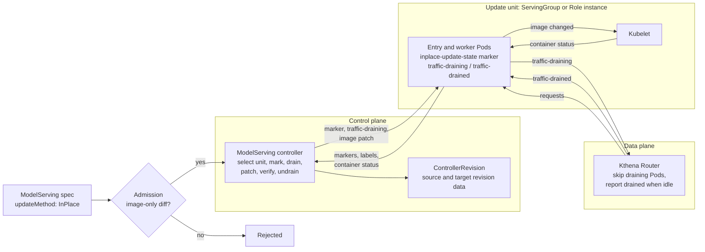
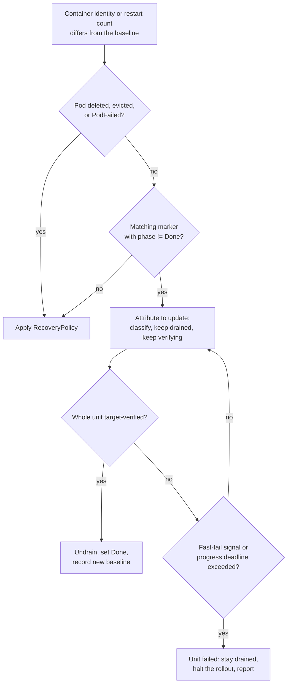

## ModelServing In-Place Rolling Update

### Summary

This proposal adds an in-place update method to `ModelServing` rollouts. When a template change only touches regular-container images, Kthena patches `spec.containers[*].image` on the existing Pods instead of deleting and recreating them. Kubelet restarts only the affected containers. Pod names, UIDs, IPs, node assignments, Pod-scoped volumes, Services, and PodGroups are preserved.

The update method is a new field, `rolloutStrategy.updateMethod`, that is independent of the rollout granularity in `rolloutStrategy.type`. Under `ServingGroupRollingUpdate` the unit of update is a ServingGroup; under `RoleRollingUpdate` it is a single Role instance.

Before its images are patched, each unit is drained: the controller marks its Pods with an annotation, the Kthena Router stops sending new requests to them and confirms when in-flight requests have finished, and only then are the images patched. The unit returns to traffic after every Pod in it is verified on the target image.

All in-progress state lives on the Pods being updated. Every step is an idempotent patch to a single Pod, and the next step is derived from observed Pod state, so a restarted controller resumes by running the same reconciliation. `ModelServing.status` gains no new fields.

### Motivation

`ServingGroupRollingUpdate` and `RoleRollingUpdate` replace outdated resources. Replacement is necessary for immutable Pod changes, but it is unnecessarily expensive when only a container image changes. Recreating a ServingGroup or Role can lose:

- Pod identity, IP, and node placement;
- accelerator and topology assignments;
- Pod-scoped data such as downloaded models or caches in `emptyDir`;
- existing Services and PodGroups; and
- scheduling and gang-admission work already completed for the workload.

Large inference workloads are particularly sensitive to rescheduling, image distribution, model initialization, and cache warm-up. An in-place update still restarts the affected process and does not preserve process memory, but it avoids repeating unrelated scheduling and data-preparation work.

Directly patching images is not enough:

- The controller treats any container with `restartCount > 0` as an error Pod and applies the configured recovery policy, so the expected restart would recreate the Role or ServingGroup.
- Rollout selection assumes that every Pod in a ServingGroup carries the same revision label.
- Nothing stops the router from sending requests to a Pod whose containers are about to restart, or to a Pod that has restarted on the new image while the rest of its unit is still being updated.

The in-place method therefore needs eligibility checks, traffic withdrawal, restart attribution, a resumable per-Pod protocol, and completion reporting.

#### Goals

- Add an opt-in, image-only update method that preserves Pod identity and placement.
- Support it at both existing granularities: ServingGroup and Role.
- Reuse the existing `maxUnavailable` and `partition` semantics of each granularity.
- Withdraw a unit from router traffic and let in-flight requests finish before its containers restart.
- Keep all in-progress state on the Pods, so that every step is idempotent and resumable after a controller restart.
- Fail closed on unsafe diffs, incompatible restart semantics, missing revision history, or unexplained live drift.
- Tolerate the uncoordinated container restarts of multi-node Role instances during an update.
- Tell the restarts caused by the image change apart from restarts for other reasons, and detect a failed update with a progress deadline, as Deployment does.
- Roll back a failed update in place by reverting the image in the spec.

#### Non-Goals

- Refreshing an unchanged mutable image tag.
- Updating init-container images or non-image Pod fields, including in-place resource resize.
- Supporting Pods or regular containers whose effective restart behavior is not `Always`.
- Supporting `maxSurge` with in-place updates. A Pod that is updated in place is not a new Pod, so there is nothing to surge.
- Automatically falling back to replacement after an image update begins.
- Automatically rolling back a failed update. Rollback is triggered by reverting the spec; see [Failure detection and rollback](#failure-detection-and-rollback).
- Withdrawing traffic that reaches Pods directly through a Kubernetes Service and bypasses the Kthena Router; see [Alternatives](#readiness-gate-for-traffic-withdrawal).
- Installing OpenKruise controllers, CRDs, webhooks, or node components.
- Providing a generic `InPlaceIfPossible` method that silently replaces when in-place is not possible.

### Proposal

Users select the update method with `spec.rolloutStrategy.updateMethod`. The granularity stays in `spec.rolloutStrategy.type`.

```yaml
apiVersion: workload.serving.volcano.sh/v1alpha1
kind: ModelServing
metadata:
  name: llama
spec:
  replicas: 4
  rolloutStrategy:
    type: ServingGroupRollingUpdate
    updateMethod: InPlace
    rollingUpdateConfiguration:
      maxUnavailable: 1
      partition: 0
  template:
    roles:
      - name: server
        replicas: 1
        workerReplicas: 2
        entryTemplate:
          spec:
            containers:
              - name: inference
                image: example.com/inference:v2
                imagePullPolicy: IfNotPresent
```

A single-ServingGroup deployment with several Role replicas uses Role granularity, so only one Role instance is out of traffic at a time:

```yaml
spec:
  replicas: 1
  rolloutStrategy:
    type: RoleRollingUpdate
    updateMethod: InPlace
  template:
    roles:
      - name: decode
        replicas: 4
        maxUnavailable: 1
        # ...
```

Omitting `updateMethod`, or setting it to `Recreate`, keeps the existing replacement behavior of either `type`. Existing manifests do not change:

```yaml
spec:
  rolloutStrategy:
    type: ServingGroupRollingUpdate   # updateMethod omitted: Recreate
    rollingUpdateConfiguration:
      maxUnavailable: 1
      maxSurge: 1
```

| `type`                      | `updateMethod`        | Behavior                                         |
| --------------------------- | --------------------- | ------------------------------------------------ |
| `ServingGroupRollingUpdate` | omitted or `Recreate` | Replace outdated ServingGroups (existing)        |
| `ServingGroupRollingUpdate` | `InPlace`             | Patch images in place, one ServingGroup per unit |
| `RoleRollingUpdate`         | omitted or `Recreate` | Replace outdated Roles (existing)                |
| `RoleRollingUpdate`         | `InPlace`             | Patch images in place, one Role instance per unit |

#### Architecture at a glance


```mermaid
flowchart LR
  User["ModelServing spec<br/>updateMethod: InPlace"] --> Admission{"Admission<br/>image-only diff?"}
  Admission -->|no| Rejected["Rejected"]
  Admission -->|yes| Controller

  subgraph CP["Control plane"]
    Controller["ModelServing controller<br/>select unit, mark, drain,<br/>patch, verify, undrain"]
    Revisions["ControllerRevision<br/>source and target revision data"]
    Controller --> Revisions
  end

  subgraph Unit["Update unit: ServingGroup or Role instance"]
    Pods["Entry and worker Pods<br/>inplace-update-state marker<br/>traffic-draining / traffic-drained"]
    Kubelet["Kubelet"]
    Kubelet -->|container status| Pods
  end

  subgraph DP["Data plane"]
    Router["Kthena Router<br/>skip draining Pods,<br/>report drained when idle"]
  end

  Controller -->|"marker, traffic-draining,<br/>image patch"| Pods
  Pods -->|"markers, labels,<br/>container status"| Controller
  Pods -->|traffic-draining| Router
  Router -->|traffic-drained| Pods
  Pods -->|image changed| Kubelet
  Router -->|requests| Pods
```

| Component | Responsibility |
| --------- | -------------- |
| Admission webhook | Rejects anything other than an eligible image-only change while `InPlace` is in effect |
| ModelServing controller | Selects units within the budget and drives each one through mark → drain → patch → verify → undrain. All decisions are derived from the Pods' markers, labels, annotations, and container status |
| Pod annotations | The only shared state: the controller's per-Pod update marker and the drain handshake between the controller and the router |
| Kthena Router | Stops routing to draining Pods, confirms when they are idle, and resumes routing when the drain annotation is removed |
| Kubelet | Restarts only the containers whose image changed and reports the running image and restart counts |

The controller and the router never call each other; they coordinate only through Pod annotations. Each side degrades safely without the other: without the router, drain completes by timeout; without the controller, no Pod is drained or patched.

#### Update units

| `type`                      | Unit of update                                                   | Budget and partition                                                |
| --------------------------- | ---------------------------------------------------------------- | ------------------------------------------------------------------- |
| `ServingGroupRollingUpdate` | One ServingGroup: every entry and worker Pod in it               | `rolloutStrategy.rollingUpdateConfiguration`, counted in ServingGroups |
| `RoleRollingUpdate`         | One Role instance (one `role-id`): its entry Pod and its workers | The Role's inlined `maxUnavailable` and `partition`, counted in Role instances |

The unit is the smallest set of Pods that must move together:

- Inside a Role instance, the entry and worker processes form one distributed engine. They must run the same image, and their restarts are coupled: when one side restarts, its peers lose their connection and restart too. A Role instance is therefore never split.
- Across Role instances there is no such coupling at the process level. Updating one Role instance while others keep serving has the same cross-Role effect as `RoleRollingUpdate` replacement has today, so Role granularity introduces no new mixed-version state.
- Users who need prefill and decode to switch versions together choose `ServingGroupRollingUpdate`, which takes the whole group out of traffic and returns it only after every Role is verified.

The implementation may land in two steps, ServingGroup units first, without changing the API or the per-Pod protocol. Until Role units are implemented, admission rejects `RoleRollingUpdate` with `updateMethod: InPlace`.

#### User Stories

##### Story 1: Patch-release engine upgrade on a multi-node deployment

An operator runs a large model with one entry Pod and several worker Pods per ServingGroup. The weights are downloaded into an `emptyDir` by an init container, and gang scheduling took minutes to place the group. A patch release of the inference engine only changes the image. With `ServingGroupRollingUpdate` and `updateMethod: InPlace`, each group is drained, both entry and worker containers restart with the new image on the same nodes, the downloaded weights are reused, and the group returns to traffic once every Pod is verified and Ready. Entry and worker containers may restart several times while they reconnect; this does not trigger recovery.

##### Story 2: Single ServingGroup with replicated Roles

A deployment has one ServingGroup with a `prefill` Role (2 replicas) and a `decode` Role (4 replicas). With `RoleRollingUpdate` and `updateMethod: InPlace`, Kthena drains and updates one Role instance at a time within each Role's `maxUnavailable`. The service keeps serving throughout the update.

#### Notes/Constraints/Caveats

- A unit is fully out of traffic while it updates. If a unit is the only one serving, for example `replicas: 1` under `ServingGroupRollingUpdate`, or a Role with `replicas: 1` under `RoleRollingUpdate`, the service is unavailable during that unit's update. In-place updates cannot surge.
- `RoleRollingUpdate` acts on all ServingGroups at the same time, as it does today. With several ServingGroups, the same Role instance may be drained in every group at once.
- Drain waits at most `--drain-timeout`. With `--drain-timeout=0`, the controller does not wait for in-flight requests before patching, and those requests may be interrupted when containers restart. The unit is still kept out of router traffic until it is verified.
- Traffic sent directly to a Pod through a Kubernetes Service is not drained. Kubelet still marks the Pod NotReady while its containers restart, which removes it from Service endpoints for that time.
- Init-container images and unchanged mutable tags are not updated. Effective image-pull behavior must stay equal.
- Unchanged containers keep their container IDs, but applications must tolerate independent restarts.
- Stable Pod identity does not preserve process memory. Router state keyed by Pod, such as the KV-cache-aware plugin's block index, may still describe the pre-restart cache; see [Risks and Mitigations](#risks-and-mitigations).
- After an in-place update, container restart counts stay above zero. The controller compares against a recorded baseline instead of `restartCount > 0`; see [Restart attribution](#restart-attribution).

#### Risks and Mitigations

| Risk | Mitigation |
| ---- | ---------- |
| A crash between steps leaves Pods of one unit in different states | Every step is idempotent and derived from the Pods' own markers and live status; see [Controller restart and crash points](#controller-restart-and-crash-points) |
| The in-memory datastore derives a ServingGroup's revision from the first Pod it observes, which is wrong while a unit has mixed revision labels | Fixed as a prerequisite: a unit counts as updated only when every Pod carries the target revision and no Pod has an unfinished marker |
| Drain never completes (router down, metrics unavailable) | `--drain-timeout` bounds the wait |
| The router is older than the controller and ignores drain annotations | Drain completes by timeout. The update still proceeds, but requests may be interrupted and a restarted Pod may receive traffic before its unit is verified |
| A bad target image crash-loops or never becomes ready | The unit fails fast on a crash-looping or invalid target image, or at `progressDeadlineSeconds`. The rollout stops selecting new units, and reverting the image in the spec rolls the unit back in place. A failed unit never takes more than its one slot |
| Router KV-cache ownership still points at a Pod whose cache was cleared by the restart | Documented constraint for the initial version. The prefix-cache store already drops state when the Pod becomes NotReady; clearing the KV-cache-aware index on the same signal is tracked as a separate router issue |
| Pull-policy or restart-policy drift changes runtime behavior | Admission compares resolved values, the controller re-checks them against live Pods before every patch, and Pod rendering writes them explicitly |
| Controller downgrade during or after an in-place update | See [Version skew](#version-skew) |

### Design Details

#### API

```go
// UpdateMethod defines how outdated Pods are moved to the desired revision.
type UpdateMethod string

const (
    // RecreateUpdateMethod deletes outdated resources and creates new ones.
    // This is the existing behavior.
    RecreateUpdateMethod UpdateMethod = "Recreate"

    // InPlaceUpdateMethod patches container images on existing Pods.
    // Only image-only template changes are allowed.
    InPlaceUpdateMethod UpdateMethod = "InPlace"
)

type RolloutStrategy struct {
    Type RolloutStrategyType `json:"type"`

    // UpdateMethod selects how outdated units are updated. An empty value
    // means Recreate.
    // +kubebuilder:validation:Enum={Recreate,InPlace}
    // +optional
    UpdateMethod UpdateMethod `json:"updateMethod,omitempty"`

    // ProgressDeadlineSeconds is the maximum time, after its images are
    // patched, for a unit to be verified on the target image before the
    // update is reported as failed. Only valid when UpdateMethod is InPlace.
    // Defaults to 1800 seconds.
    // +kubebuilder:validation:Minimum=60
    // +optional
    ProgressDeadlineSeconds *int32 `json:"progressDeadlineSeconds,omitempty"`

    RollingUpdateConfiguration *RollingUpdateConfiguration `json:"rollingUpdateConfiguration,omitempty"`
}
```

`updateMethod` and `progressDeadlineSeconds` have no CRD defaults, so existing stored objects do not change when the CRD is upgraded; the controller applies the 1800-second default for `progressDeadlineSeconds` at runtime. The default is longer than Deployment's 600 seconds because loading a large model on restart routinely takes several minutes. No status fields are added. The change regenerates CRDs, clients, deepcopy code, the API reference, and the embedded Helm CRDs with `make generate`.

Admission rules when `updateMethod: InPlace`:

- `maxSurge` must be unset or resolve to 0, at both the ModelServing and Role level.
- `maxUnavailable` must resolve to at least 1 against the unit count: `spec.replicas` for ServingGroup units, the Role's `replicas` for Role units. The existing exception that allows 0 when `maxSurge` is positive does not apply. For example, `25%` with 3 replicas is rejected.
- `partition` keeps its existing meaning and validity for each `type`.
- `progressDeadlineSeconds` is rejected unless `updateMethod` is `InPlace`.
- All three recovery policies (`ServingGroupRecreate`, `RoleRecreate`, `None`) are accepted. They act only on the failures described under [Restart attribution](#restart-attribution).

Because the scale subresource can change replica counts without passing this check, the controller also resolves `maxUnavailable` at runtime and uses 1 if it resolves to 0, following the Deployment controller's rule for the case where both budgets are 0.

The controller manager gains one flag, `--drain-timeout` (default `5m`), exposed in the Helm chart as `controllerManager.drainTimeout`. It bounds how long the controller waits for the router to confirm that a unit is drained.

##### Version skew

- **New CRD not applied.** The API server prunes the unknown `updateMethod` field, and the object is updated by replacement. Helm does not update CRDs during `helm upgrade`, so operators must apply the new CRDs, as the installation guide already requires.
- **New CRD, older controller.** The older controller ignores `updateMethod` and updates by replacement, which is the default behavior.
- **Newer controller, older router.** The router ignores the drain annotations. See [Risks and Mitigations](#risks-and-mitigations).
- **Downgrade.** An older controller does not understand markers, does not remove drain annotations, and treats any `restartCount > 0` as an error. To downgrade:
  1. Switch every object to `updateMethod: Recreate` and wait for `UpdateInProgress=False`, so no unit is left drained.
  2. Expect Pods that were previously updated in place to be recreated under their `RecoveryPolicy` by the older controller. To control when that happens, roll them out under `Recreate` (for example with a template annotation change) before downgrading.

#### Admission and Eligibility

For `updateMethod: InPlace`, admission decodes both `Object` and `OldObject` on updates and compares them after applying the same defaulting. A template change is eligible only when:

- Role names and order, entry/worker template structure, and container names and order are unchanged;
- every entry and worker Pod resolves to `restartPolicy: Always`, and regular containers have no restart override or restart rules;
- replacing the new regular-container images with the old images makes the normalized templates semantically equal, after resolving Kubernetes-defaulted restart and pull policies;
- every container's target effective `imagePullPolicy` equals its source effective policy; an omitted-to-explicit change is allowed only when it resolves to the same value;
- init-container images and all other normalized non-image Pod fields are unchanged;
- plugin configuration and `spec.schedulerName` are unchanged, and every plugin declares compatibility; and
- only documented scaling and rollout-control fields differ outside the image changes, and `workerReplicas` is unchanged.

Eligibility is atomic across Roles: if any Role fails a check, the whole request is rejected. A `workerReplicas` change affects Pod topology and generated environment, so it requires `updateMethod: Recreate`.

Effective restart and pull policies are a pure function of the stored template under Kubernetes defaulting rules, so they are computed rather than stored. Admission, the controller's eligibility check, and Pod rendering share one resolver. The resolver treats an empty `restartPolicy` as `Always` and rejects other values, and Pod rendering writes the resolved values explicitly. An omitted pull policy is resolved before comparison. For example, an omitted `:latest` to pinned-tag transition changes the derived policy from `Always` to `IfNotPresent` and is rejected unless the target explicitly keeps `Always`.

Switching from `Recreate` to `InPlace` requires the previous rollout to be complete in the old object: `status.observedGeneration == metadata.generation`, `status.currentRevision == status.updateRevision`, and `status.updatedReplicas == status.replicas == spec.replicas`. The same request may also change images, because every unit then starts from the same source revision. Switching to `Recreate` permits arbitrary template changes, because it authorizes recreation.

Admission improves feedback but is not the safety boundary. Before patching any Pod, the controller repeats the comparison between the unit's source revision and the target revision using the stored `ControllerRevision` data, and verifies the resolved policies against every live Pod in the unit. A unit whose source revision is missing or inconsistent with its live Pods stalls with `RevisionHistoryMissing`. A unit whose source-to-target diff is not eligible stalls with `InPlaceUpdateIneligible`. Neither is replaced automatically.

#### Revisions

Eligibility compares full revision data: the normalized Roles, `spec.schedulerName`, and plugins, stored immutably in a `ControllerRevision`. Today the controller identifies revisions by a hash of the Roles only; switching it to the full revision data is a [prerequisite](#prerequisites-and-delivery-order).

The target revision of every unit is the ModelServing's current update revision. A unit's source revision is the revision label its Pods carried when its update started, recorded in each Pod's marker. Revision history cleanup must keep every revision referenced by a live Pod's revision label or by an unfinished marker.

Under in-place updates, the Pods of one unit can briefly carry different revision labels. The controller treats a unit as updated only when every Pod in it carries the target revision and role-template-hash labels and no Pod has an unfinished marker. This replaces the current behavior of deriving a ServingGroup's revision from the first Pod observed after a controller restart, and the fix is a prerequisite.

#### Pod state

Each Pod in a unit that is being updated carries one controller-owned annotation:

```text
modelserving.volcano.sh/inplace-update-state
```

Its value is versioned JSON:

```json
{
  "version": 1,
  "ownerUID": "<ModelServing UID>",
  "podUID": "<Pod UID>",
  "unit": "<group-name> or <group-name>/<role-id>",
  "sourceRevision": "<revision>",
  "targetRevision": "<revision>",
  "previousTargets": ["<revision>"],
  "phase": "Draining | Patched | Done",
  "startedAt": "<RFC3339>",
  "patchedAt": "<RFC3339>",
  "baseline": {
    "<container name>": {"containerID": "<id>", "restartCount": 0}
  },
  "patched": {
    "<changed container name>": {"image": "<target image>", "restartCount": 0}
  }
}
```

- A marker whose `ownerUID` or `podUID` does not match the live objects is ignored, as if absent.
- A unit is **in update** while any of its Pods has a matching marker with `phase` other than `Done`. That is the only definition of an in-progress update.
- `baseline` holds the restart counts when the Pod was marked. `patched` holds, for each container whose image the patch changed, the target image and the container's restart count at the moment of the patch. It is written in the same guarded request as the image change, and the resource-version guard also covers Pod status, so the recorded counts are exact.
- `Done` markers are kept as the restart baseline for that Pod; at completion, `baseline` is replaced by the post-update restart counts and `patched` is cleared.
- The marker and the two drain annotations described under [Traffic withdrawal](#traffic-withdrawal) are the only annotations this feature writes. Spec patches only change eligible image fields and the revision and role-template-hash labels.

#### Traffic withdrawal

The controller and the router coordinate through two Pod annotations. They never call each other, consistent with the separation between the control and data planes.

| Annotation | Written by | Value | Meaning |
| ---------- | ---------- | ----- | ------- |
| `modelserving.volcano.sh/traffic-draining` | Controller | RFC3339 timestamp | Do not send new requests to this Pod |
| `modelserving.volcano.sh/traffic-drained`  | Router     | `"true"`          | No requests are running or waiting on this Pod |

**Router.**

- The router watches `traffic-draining` on Pods. A draining Pod stays in the router's state, so metrics scraping and in-flight tracking continue, but it is excluded from every scheduling-candidate query, including PD-disaggregated selection.
- Once the Pod's engine metrics report zero running and zero waiting requests, and the Pod has been excluded for at least one metrics scrape interval, the router patches `traffic-drained: "true"` onto the Pod, with bounded retries. Engine metrics also count requests that did not pass through this router replica, and the scrape-interval wait covers other router replicas that observe the annotation slightly later.
- When `traffic-draining` is removed, the router includes the Pod in scheduling again and clears any cached drained state, so a later drain is confirmed from fresh metrics.

**Controller.**

- The controller sets `traffic-draining` on every Pod in the unit, entry and worker, so a ModelServer whose selector also matches worker Pods stops routing to them.
- The unit is drained when every **entry** Pod in the unit carries `traffic-drained`, or when `--drain-timeout` has elapsed since the earliest `traffic-draining` timestamp in the unit. Entry Pods serve the inference API; worker Pods do not expose engine request metrics.
- With `--drain-timeout=0` the controller treats the unit as drained immediately, but still sets `traffic-draining` so the router keeps the unit out of traffic until it is verified.
- After the unit is verified, the controller removes both annotations from every Pod in the unit.
- A Pod with an unfinished marker is never deleted because it carries `traffic-drained`.

Keeping `traffic-draining` on the unit until verification is what prevents the router from sending requests to a Pod that has restarted on the new image while the rest of its unit is still updating. No readiness gate or `pods/status` access is needed, and existing workloads need no preparation before they can use `InPlace`.

#### Update flow

For each unit selected under the budget:

```mermaid
sequenceDiagram
  participant C as Controller
  participant P as Unit Pods
  participant R as Kthena Router
  participant K as Kubelet

  C->>P: Write marker (phase=Draining, baseline)
  C->>P: Set traffic-draining
  R-->>P: Stop routing; set traffic-drained when idle
  C->>C: Wait for drain completion or --drain-timeout
  C->>P: Patch images + revision labels, phase=Patched (one JSON patch per Pod)
  P->>K: Image fields changed
  K-->>P: Restart affected containers
  C->>C: Wait until every Pod in the unit is target-verified
  C->>P: Remove traffic-draining and traffic-drained
  R-->>P: Resume routing
  C->>P: phase=Done, record new baseline
```

1. **Mark.** For every Pod in the unit, write the marker with `phase: Draining`, the source and target revisions, and the current container IDs and restart counts as the baseline. The patch is preconditioned on the Pod's resource version.
2. **Drain.** Set `traffic-draining` on every Pod in the unit and wait for drain completion as defined under [Traffic withdrawal](#traffic-withdrawal).
3. **Patch.** For each Pod, apply one JSON patch that:
   - uses `test` operations on the owner, `restartPolicy`, resolved pull policies, and the current image of each container being changed;
   - replaces only the eligible regular-container images that differ from the target;
   - sets the revision and role-template-hash labels to the target; and
   - sets the marker to `phase: Patched`, with `patchedAt` and the `patched` record of every changed container.

   Because the image, labels, and phase change in one request, each Pod is either fully patched or untouched. A Pod whose images already match the target still gets the label and phase change, so the whole unit converges to one revision.
4. **Verify.** A Pod is target-verified when its marker matches, its spec and labels match the target revision, its restart and pull policies still match the resolved values, every regular container reports the exact target image, and `ContainersReady=True`. Image names are compared using Kubernetes-compatible OCI normalization; a runtime image that cannot be verified leaves the Pod incomplete instead of producing a false success.
5. **Undrain.** Only after **every** Pod in the unit is target-verified, remove `traffic-draining` and `traffic-drained` from every Pod.
6. **Complete.** Set each marker to `phase: Done` and record the current container IDs and restart counts as the new baseline. The unit's availability slot is released when every marker is `Done` and every Pod is Ready.

A live image that equals the source revision or a revision in `previousTargets` is expected. Any other live image is unexplained drift: the unit stalls with `UnexplainedImageDrift` instead of overwriting it.

#### Reconciliation

The controller derives each unit's next action from the desired target revision, the Pods' markers and labels, the drain annotations, and live container status. It does not read any in-progress state from the in-memory datastore or from `ModelServing.status`.

| Observed state of the unit | Action |
| -------------------------- | ------ |
| No unfinished markers, outdated, budget available, not protected by `partition` | Step 1 (mark) |
| Some Pods marked, some not | Mark the rest |
| All marked; `traffic-draining` missing on some Pods | Set it |
| Drain not complete and not timed out | Wait |
| Drain complete; some Pods not yet patched | Patch them |
| All patched; not every Pod verified | Wait; fail the unit on a fast-fail signal or at the progress deadline (see [Failure detection and rollback](#failure-detection-and-rollback)) |
| All verified; drain annotations still present on some Pods | Remove them |
| All verified and undrained; markers not `Done` | Set `Done` and record baselines |
| A Pod in an unfinished unit is not verified but already undrained (for example, a container crashed after partial undrain) | Set `traffic-draining` on it again and wait |

Other rules:

- **Budget.** `unavailable = units that are not fully Ready ∪ units in update`. A new unit is selected only while `maxUnavailable - |unavailable| > 0`. A unit created by scale-up counts as unavailable until Ready.
- **Halt.** While any unit has failed, no new unit is selected; see [Failure detection and rollback](#failure-detection-and-rollback).
- **Partition.** `partition` prevents starting an update on protected units. A unit that is already in update when `partition` is raised finishes its target.
- **Retarget.** If the desired revision changes while a unit is in update and the new diff from the unit's source revision is eligible, the controller rewrites `targetRevision` on each marker (appending the old target to `previousTargets`) before patching that Pod again. The new patch rewrites `patchedAt` and `patched`, which restarts the progress deadline. The unit stays drained and keeps its slot. After a crash, a marker whose target differs from the desired revision is rewritten before any further patch.
- **Scaling.** Role scaling is ordered before new update selection. Pods created for a unit that is in update are rendered from the unit's target revision, receive a marker with `phase: Patched` and the `traffic-draining` annotation, and stay out of traffic until the unit is verified. Pods created for any other unit use the existing rendering path.

#### Controller restart and crash points

Every action above is idempotent, and every precondition is observable on the Pods. A restarted controller rebuilds its datastore from the informers and runs the same reconciliation; it never needs to remember which step it was on.

| Crash after | Restarted controller observes | Result |
| ----------- | ----------------------------- | ------ |
| Writing markers on k of N Pods | Unfinished markers on k Pods | The unit counts as in update; the remaining Pods are marked |
| Setting `traffic-draining` on some Pods | Mixed drain annotations | The rest are set; the timeout is measured from the earliest timestamp |
| Patching k of N Pods | k Pods with target labels and `phase: Patched`, N−k with source labels | The remaining Pods are patched; each patch is atomic per Pod, and `test` operations make repeats no-ops or conflicts |
| A Pod patch that the API server applied but the controller did not see acknowledged | Target labels and `phase: Patched` | Treated as patched |
| Removing drain annotations from some Pods | Some Pods back in traffic, all verified | Undrain finishes; nothing is drained again unless a Pod stops being verified |
| Undrain, before setting `Done` | All undrained, markers `Patched` | Markers set to `Done` and baselines recorded |
| Rewriting markers to a new target on some Pods | Markers with different `targetRevision` values | Stale markers are rewritten before any further patch |
| Switching to `Recreate` mid-update | Unfinished markers under `Recreate` | See [Switching back to Recreate](#switching-back-to-recreate) |

Conflicts on any Pod patch cause a re-read and re-evaluation; a Pod is never patched from stale state.

A router restart loses no state either: the draining flag is rebuilt from the annotation, and `traffic-drained` is either already on the Pod or is written again after the next scrape.

#### Restart attribution

The controller does not classify a restart from `restartCount > 0` alone, because counts are cumulative and a completed in-place update leaves them above zero. It compares each container against a baseline:

- a Pod with a matching `Done` marker uses the baseline recorded in the marker;
- a Pod without a marker keeps today's behavior, where any restart count above zero is a failure; this is equivalent to a baseline of zero at creation.

There are two regimes:

- **Update window.** While a Pod has a matching marker whose `phase` is not `Done`, no container restart in that Pod invokes `RecoveryPolicy`. The unit is already drained and counted against `maxUnavailable`, so absorbing the restart cannot reduce capacity further. Restarts in the window are still classified, so that a failed update can be detected and reported:

  | Restart | Detection | Meaning |
  | ------- | --------- | ------- |
  | Pre-update | Any restart beyond `baseline` while `phase` is `Draining` | The old image restarted before the patch; the patch replaces it anyway |
  | Image change | A container in `patched` whose restart count is exactly one above its `patched` count and whose running image is the target | The single restart kubelet performs to apply the new image. Expected |
  | Other | Any further restart of a container in `patched`; any restart of a container not in `patched`, including init containers | A crash of the new image, or a restart triggered by a peer in the same unit. Counted and reported, and used for fast-fail |

  Other restarts are not failures one at a time. In a multi-node unit, when the entry container restarts on the new image, workers lose their peer and restart too, even if their own image did not change; reacting to each such restart would roll back nearly every multi-node update. Failure is decided for the unit as a whole, as described under [Failure detection and rollback](#failure-detection-and-rollback).
- **Outside the window.** Any change from the baseline is a failure and follows `RecoveryPolicy`, as today.

Pod loss is never absorbed. Deletion, eviction, and `PodFailed` follow `RecoveryPolicy` in both regimes. If recovery recreates only some Pods of a unit that is in update, the new Pods follow the scaling rule above. If it recreates the whole Role instance or ServingGroup, the new Pods are created at the desired revision without markers and the unit no longer needs an in-place update.


```mermaid
flowchart TD
  Observe["Container identity or restart count<br/>differs from the baseline"] --> Loss{"Pod deleted, evicted,<br/>or PodFailed?"}
  Loss -->|yes| Recovery["Apply RecoveryPolicy"]
  Loss -->|no| Window{"Matching marker<br/>with phase != Done?"}
  Window -->|no| Recovery
  Window -->|yes| InUpdate["Attribute to update:<br/>classify, keep drained, keep verifying"]
  InUpdate --> Verified{"Whole unit target-verified?"}
  Verified -->|yes| Complete["Undrain, set Done,<br/>record new baseline"]
  Verified -->|no| Failed{"Fast-fail signal or<br/>progress deadline exceeded?"}
  Failed -->|no| InUpdate
  Failed -->|yes| Halt["Unit failed: stay drained,<br/>halt the rollout, report"]
```

This regime is what makes multi-node units safe to update. Kubelets on different nodes restart containers independently, so an entry container can start while a worker still runs the old image, lose its peer, and restart again. Treating that as a failure would trigger `RoleRecreate` or `ServingGroupRecreate` and defeat the purpose of the feature.

Restart attribution runs whenever a Pod update is observed, before the existing ready and error handling; again before grace-period recovery deletes a Pod; and during full reconciliation after a controller restart.

#### Failure detection and rollback

As with Deployment, individual restarts in the update window trigger no action; a unit fails only when it stops making progress after its images are patched:

| Trigger | Condition |
| ------- | --------- |
| Progress deadline | Not target-verified within `progressDeadlineSeconds` (default 1800) of the unit's earliest `patchedAt` |
| Fast-fail | A changed container is in `CrashLoopBackOff` on the target image after three *other* restarts, or reports `InvalidImageName` or `ErrImageNeverPull` |

`ImagePullBackOff` is often transient, so it fails only at the deadline.

When a unit fails, `UpdateInProgress` reports `ProgressDeadlineExceeded` or `InPlaceUpdateFailed` with the failing container's restart counts and last termination reason, and no new unit is selected. The failed unit stays drained; if it becomes verified later, the rollout resumes.

**Rollback** is done by reverting the images in the spec. The revert is an image-only change, so failed and in-progress units are [retargeted](#reconciliation) and completed units are updated back, all in place. Switching to `updateMethod: Recreate` replaces in-progress units instead. Automatic rollback is out of scope, because it would require recording failed revisions in durable state.

#### Switching back to Recreate

Switching `updateMethod` to `Recreate` cancels in-place updates without extra state:

- A Pod with an unfinished marker counts as **outdated** under `Recreate`, whatever its revision labels say, because its image may be patched without verification. The normal `Recreate` path then replaces its unit within the existing budget, and the marker disappears with the Pod.
- Units whose markers are all `Done` are left alone. They are replaced only when the normal `Recreate` outdated check selects them.

This adds one rule to the existing outdated selection; it changes nothing for objects that never used `InPlace`.

#### Component Changes

ModelServing controller:

- **Rollout.** For `InPlace`, the rollout runs the in-place reconciler instead of deleting outdated resources. Selection, budget, and partition follow the granularity rules above.
- **Outdated selection.** A unit with an unfinished marker is outdated under `Recreate`. A unit is updated only when every Pod carries the target labels and has no unfinished marker.
- **Pod events and recovery.** Restart attribution runs before the existing error-Pod handling and before grace-period recovery. Pods without a marker keep today's behavior.
- **Pod creation.** Pods created for a unit that is in update are rendered from that unit's target revision, with the marker and drain annotation. All Pods rendered under `InPlace` get the resolved restart and pull policies written explicitly.
- **Status and history.** Status counters are computed from the per-unit rules above, and revision cleanup keeps revisions referenced by live Pod labels and unfinished markers.
- **Configuration.** The `--drain-timeout` flag and the `controllerManager.drainTimeout` Helm value.

Kthena Router:

- **Pod watch.** The `traffic-draining` annotation is tracked for every Pod the router knows about.
- **Scheduling.** Draining Pods are excluded from every candidate query.
- **Metrics loop.** `traffic-drained` is written once a draining Pod is idle, as described under [Traffic withdrawal](#traffic-withdrawal).

#### Status, Events, and Diagnostics

No status fields are added. Existing counters are computed from the Pods:

| Field               | Meaning under `InPlace` |
| ------------------- | ----------------------- |
| `replicas`          | Observed ServingGroups. |
| `updatedReplicas`   | ServingGroups in which every Pod carries the target revision and none has an unfinished marker. |
| `currentReplicas`   | ServingGroups not yet fully on the target revision. |
| `availableReplicas` | ServingGroups whose required Pods are Ready and not draining. |

`UpdateInProgress` reports, per ModelServing, the dominant reason across units: `Draining`, `Patching`, `Verifying`, `ProgressDeadlineExceeded`, `InPlaceUpdateFailed`, `InPlaceUpdateIneligible`, `RevisionHistoryMissing`, or `UnexplainedImageDrift`. A unit that is waiting on a transient signal such as `ImagePullBackOff` reports `Verifying` with the signal in the message. It becomes `False` with reason `RolloutComplete` when no unit is outdated and no marker is unfinished.

Events report drain start, drain timeout, image patch, restarts absorbed during an update with their kind (pre-update, image change, other), undrain, completion, unit failures, rollout halts, ineligible changes, and patch failures. Structured logs include the ModelServing, unit, Pod, and source and target revisions, but never raw annotation contents.

#### Plugin Semantics

Plugin compatibility is explicit registry metadata, equivalent to an `InPlace` capability flag. Existing registrations default to incompatible; compatible plugins opt in through a capability-aware registration path. Empty plugin configuration is compatible, while unknown or incompatible plugins block `InPlace`.

`OnPodCreate` is not called for an image patch, so a compatible plugin must not require that hook to transform the target image or another immutable field. Existing plugin mutations remain on the Pod, and `OnPodReady` runs again through the normal Ready event after the update. Plugin configuration cannot change while `InPlace` is in effect.

#### RBAC and Security

- **Controller manager:** `patch` on `pods`. It does not need `pods/status`.
- **Router:** `patch` on `pods`, used only to write `traffic-drained`.

Before each patch, the controller verifies the controlling ModelServing UID and the expected ServingGroup and Role, and JSON patch `test` operations guard the fields it relies on. Controller spec patches are limited to eligible image fields; metadata patches are limited to the marker, the drain annotations, and the revision and role-template-hash labels. The router writes only `traffic-drained`, and only on Pods that carry `traffic-draining`.

#### Prerequisites and delivery order

1. **Full revision data.** The controller identifies revisions by the full revision data stored in `ControllerRevision`s instead of a hash of the Roles only.
2. **Per-unit revision tracking.** A ServingGroup's revision is no longer taken from the first Pod observed; mixed revision labels within a unit mark it as not updated.
3. **Drain protocol.** The annotations, the router behavior, `--drain-timeout`, and the RBAC changes described under [Traffic withdrawal](#traffic-withdrawal).
4. **API and admission.** The `updateMethod` field, eligibility checks, and the shared policy resolver.
5. **In-place reconciler for ServingGroup units.**
6. **In-place reconciler for Role-instance units.** Until this lands, admission rejects `RoleRollingUpdate` with `InPlace`.

Steps 1–3 are independent changes that are useful on their own.

### Test Plan

| Area | Unit coverage | Kind-based controller-manager and router coverage |
| ---- | ------------- | ------------------------------------------------- |
| API and admission | `updateMethod` with each `type`; `maxSurge` rejected; `maxUnavailable` resolving to 0 rejected; every recovery policy; `OldObject` defaulting; switching from `Recreate` only after a complete rollout | Unsafe requests are rejected; runtime `maxUnavailable` clamp after scale-subresource changes |
| Eligibility and policy | Image-only and structural comparisons; atomic multi-Role eligibility; omitted and invalid restart policies; omitted-to-explicit pull policy; unsafe plugins | Rendered Pods carry `restartPolicy: Always` and resolved pull policies |
| Drain protocol | Router excludes draining Pods from every candidate query; `traffic-drained` written only after zero running and waiting requests and one scrape interval; removal of `traffic-draining` re-includes the Pod and clears drained state; controller completion on entry Pods and on timeout | In-flight streaming requests finish before containers restart; drain timeout fallback; `--drain-timeout=0` |
| Update flow | Mark → drain → patch → verify → undrain → done ordering; per-Pod atomic patch; `test` guard conflicts; metadata-only Pods; drift detection | Entry, worker, multi-container identity preservation; only changed containers restart; no request reaches the unit between drain and undrain |
| Crash points | Each row of the crash-point table, by starting reconciliation from that Pod state | Controller killed during drain, mid-patch, and mid-undrain; router restarted during drain; rollout resumes without extra slots or recreation |
| Selection | Budget with in-update units and scale-up; `partition`; retargeting including a crash between marker rewrites | `maxUnavailable`, `partition`, successive targets, bad-image stall, good-image retarget |
| Role units | Role-instance selection and per-Role budget | Single ServingGroup with replicated Roles stays serving during the update |
| Restart attribution | Restarts inside the window never invoke recovery; restarts outside it do; baseline after `Done`; mismatched markers; Pod loss during the window; classification into pre-update, image-change, and other restarts, including peer restarts of unchanged containers | Multi-node unit whose entry and workers restart several times completes without recreation; a later unrelated crash follows each recovery policy |
| Failure and rollback | Progress deadline from the earliest `patchedAt`; fast-fail on `CrashLoopBackOff` after three other restarts and on `InvalidImageName`; no fast-fail on `ImagePullBackOff`; halt of new selections; late verification resumes the rollout; spec revert retargets failed and completed units | Crash-looping target image fails the unit and halts the rollout; reverting the image rolls the unit back in place without rescheduling |
| Switching to Recreate | Unfinished markers make a unit outdated regardless of labels; `Done` markers do not | Mid-update switch replaces only in-progress units |

### Alternatives

#### A new `RolloutStrategyType` value

An `InPlaceRollingUpdate` value next to `ServingGroupRollingUpdate` and `RoleRollingUpdate` would mix two independent choices, the unit of update and the update method, and would need yet another value for Role-level in-place updates. It would also be unsafe under version skew: today's controller sends every value other than `ServingGroupRollingUpdate` down the Role replacement path. A separate field keeps the two choices orthogonal, and an older controller simply ignores it.

#### Readiness gate for traffic withdrawal

A Kthena readiness gate on every Pod, set to `False` before patching, would also remove the Pod from Service endpoints, which drain does not. It is not used because:

- readiness gates are immutable after Pod creation, so existing workloads would need a one-time replacement rollout before they could use in-place updates;
- gated Pods never become Ready while the controller is down, which would also block normal scale-up and recovery; and
- a readiness change gives no confirmation that in-flight requests have finished, so a fixed delay would be needed before patching.

If Service-direct traffic comes into scope, a gate can be added later as an optional mechanism on top of drain.

#### Reservation state in `ModelServing.status`

Recording a per-unit reservation and target revision in `ModelServing.status` before touching any Pod would make every step a write to two kinds of objects that cannot be updated atomically, and would create a second source of truth next to the Pods. Keeping the state on the Pods being mutated makes each step a single-object, idempotent patch.

#### Use OpenKruise

OpenKruise provides mature in-place update utilities and workload resources such as CloneSet and Advanced StatefulSet. Importing its Pod updater would couple Kthena to OpenKruise API types, state keys, readiness behavior, and fallback semantics. Adopting its workloads would add CRDs and controllers whose ownership and status models do not understand ServingGroups, Roles, PodGroups, plugins, or recovery policy. Kthena therefore owns a narrow image-only updater; its per-Pod state annotation follows the same approach as OpenKruise's `apps.kruise.io/inplace-update-state`.
